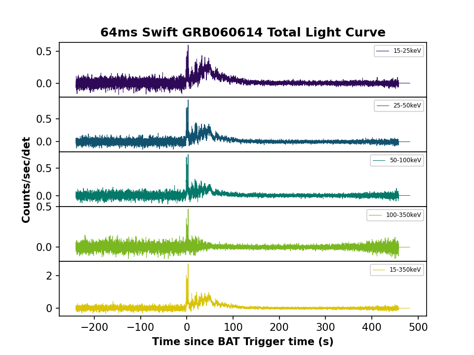

---
title: 'ClassiPyGRB: Machine Learning-Based Classification and Visualization of Gamma Ray Bursts using t-SNE'
tags:
  - Python
  - astronomy
  - transient astronomy
  - gamma ray bursts
  - extragalactic astronomy
authors:
  - name: Keneth Garcia-Cifuentes
    orcid: 0009-0001-2607-6359
    equal-contrib: true
    affiliation: 1
    corresponding: true # (This is how to denote the corresponding author)
  - name: Rosa L. Becerra
    orcid: 0000-0002-0216-3415
    affiliation: 1
  - name: Fabio De Colle
    orcid: 0000-0002-3137-4633
    affiliation: 1
affiliations:
 - name: Instituto de Ciencias Nucleares,  Universidad Nacional Autónoma de México, Apartado Postal 70-543, 04510 CDMX, México
   index: 1
date: 22 May 2023
bibliography: paper.bib
--- 

# Summary
Gamma-ray burst (GRBs) are the brightest events in the universe. For decades, astrophysicists have known about their cosmological nature. Every year, space missions such as Fermi and SWIFT detect hundreds of them. In spite of this large sample, GRBs show a complex taxonomy in the first seconds after their appearance, which makes it very difficult to find similarities between them using conventional techniques.

It is known that GRBs originate from the death of a massive star or from the merger of two compact objects. GRB classification is typically based on the duration of the burst [@Kouveliotou:1993]. Nevertheless, events such as GRB 211211A [@Yang:2022], whose duration of about 50 seconds lies in the group of long GRBs, has challenged this categorization by the evidence of features related with the short GRB population (the kilonova emission and the properties of its host galaxy). Therefore, a classification based only on their gamma-ray duration does not provide a completely reliable determination of the progenitor.

Motivated by this problem, @Jespersen:2020 and @Steinhardt:2023 carried out analysis of GRB light curves by using the t-SNE algorithm, showing that Swift/BAT GRBs database, consisting of light curves in four energy bands (15-25 keV, 25-50 keV, 50-100 keV, 100-350 keV), clusters into two groups corresponding with the typical long/short classification. However, in this case, this classification is based on the information provided by their gamma-ray emission light curves. 

**ClassiPyGRB** is a Python 3 package to download, process, visualize and classify GRBs database from the [Swift/BAT Instrument](https://swift.gsfc.nasa.gov/about_swift/bat_desc.html) (up to July 2022). It is distributed over the GNU General Public License Version 2 (1991). We also included a noise-reduction and an interpolation tools for achieving a deeper analysis of the data.

# Statement of need

The Swift Burst Alert Telescope (BAT) is a wide-field, hard Gamma-ray detector that, since its launch in 2004, has played an important role inthe high-energy astrophysical field. A preliminary query on the Astrophysics Data System (ADS) with the keyword "Swift/BAT" indicates that over 7000 research works have been uploaded to its platform (up to December 2023). Furthermore, the number of studies per year is increasingly, evidencing the relevance and impact of the use of the Swift/BAT database.

Although the Swift/BAT database is publicly available, for first-time users it might be a challenge to download and process the data. The data are stored in multiple directories, depending on the GRB. Moreover, the data are not pre-processed, and the user must perform the data manipulation and interpolation themselves. These issues make the data processing a time-consuming task. `ClassiPyGRB` is a Python 3 package that aims to solve these problems by providing a simple and intuitive interface to download, process, visualize, and classify the photometric data of GRBs from the Swift/BAT database. `ClassiPyGRB` can also been used to promptly find similar GRBs with some specific feature, such as a bright component [@Angulo-Valdez:2024].

ClassiPyGRB allows researchers to query light curves for any GRB in the Swift/BAT database simply and intuitively. The package also provides a set of tools to preprocess the data, including noise/duration reduction and interpolation. Moreover, The package also provides a set of facilities and tutorials to classify GRBs based on their light curves, following the method proposed by Jespersen et al.(2020) and Garcia-Cifuentes et al.(2023) (see e.g., Figure 1). This method is based on dimensionality reduction of the data using t-distributed Stochastic Neighbour Embedding (t-SNE), where the user can visualize the results using a Graphical User Interface (GUI). The user can also plot and animate the results of the t-SNE analysis, allowing to perform a deeper hyperparameter grid search. The package is distributed over the GNU General Public Licence Version 2 (1991).

Although Swift/BAT offers basic functionality for data retrieval and analysis, it is still necessary to implement a package that allows the user to access and use the data in a simple way. In our case, ClassiPyGRB is completely focused on GRB science. It complements what other Python packages oriented to the Swift/BAT instrument do, such as:

1) The NITRATES pipeline [@DeLaunay:2022], designed for maximum likelihood-driven discovery and localization of Gamma Ray Bursts.
2) BatAnalysis [@Parsotan:2023], a package specializing in photometry from all sources observed by the BAT instrument, not just in GRBs.

Thus, ClassiPyGRB distinguishes itself by offering a comprehensive solution that addresses the entire workflow of GRBs, from data retrieval to classification. This package facilitates the entire process of GRB analysis, ensuring accessibility, efficiency, and robustness for researchers in the field of gamma-ray astronomy.

# Methodology and Structure of ClassiPyGRB

`ClassiPyGRB` mainly consists of three parts:

1) Retrieval and visualization of data from Swift/BAT: We implement an easy and fast code to download and plot an existing GRB post-processed data (e.g., Figure 2). There is the possibility to modify the time resolution of the data files (2ms, 8ms, 16ms, 64ms, 256ms, 1s and 10s) and analyze the data by selecting only some of the energy bands. 

2) Data processing. `ClassiPyGRB` is able to: 

  - Constrain the light curves by their duration $T_\mathrm{100}$, $T_\mathrm{90}$ or $T_\mathrm{50}$.
  - Normalize the flux.
  - Standardize the temporal interval of all the sample (by zero-padding).
  - Improve the signal/noise (S/N) ratio applying the non-parametric noise reduction technique called FABADA [@Sanchez-Alarcon:2022] to each band for every single light curve. 
  - Interpolate the flux between two specific times.

3) Visualization and plotting of t-SNE maps. `ClassiPyGRB` produces 2D visualization maps colored by the duration of GRBs.

- It includes an intuitive graphic interface.
- It is possible to add either of the two features to the t-SNE maps or to visualize the raw data.
- Manipulation of the t-SNE parameters.
- Visualization of the light curves from the events with and without noise-reduction.
- There is the possibility of working only on the desired bands of Swift/BAT.
- Specific events can be searched for and highlighted on the display.

Any plots created with `ClassiPyGRB` can be customized by the user.

Note: Algorithms such as t-SNE visualization maps are very sensitive to any change in the perplexity and learning rate parameters. Therefore, as is the case when using any of these visualization techniques derived from machine learning, care must be taken in the correct interpretation of the data.

This repository requires Python 3.8 or higher, and the necessary packages will be automatically handled during installation. Other packages will be required optionally in Documentation (i.e., Jupyter).

# Acknowledgements

KSGC acknowledges support from CONACyT fellowship. RLB acknowledges support from CONACyT postdoctoral fellowship.

# References
