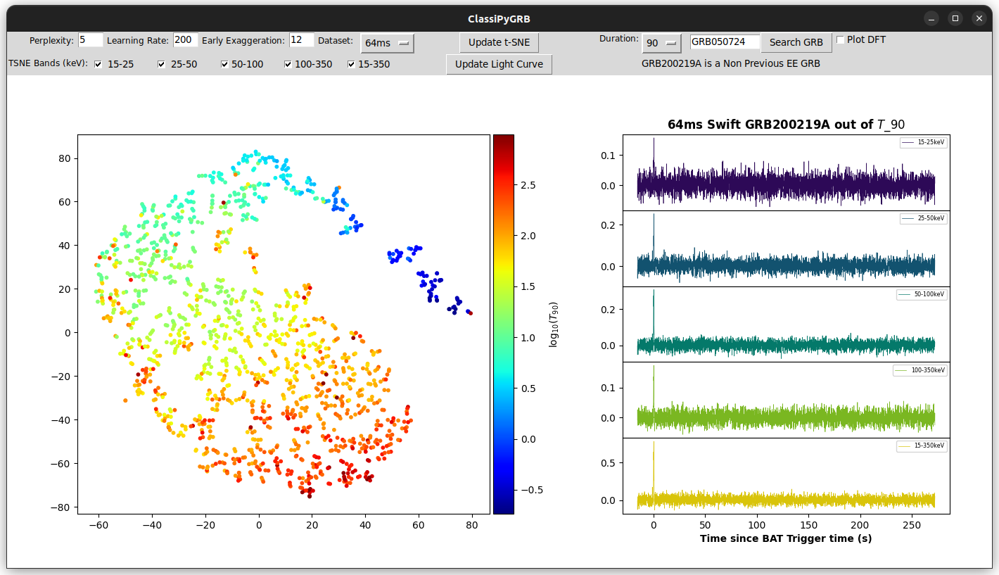

  

**ClassiPyGRB** is a Python 3 package to download, process, visualize and classify Gamma-Ray-Bursts (GRBs) from the Swift/BAT Telescope (https://swift.gsfc.nasa.gov/about_swift/bat_desc.html) database. It is distributed over the GNU General Public License Version 2 (1991). Please, read the complete description of the method and its application to GRBs in this [publication](JOSS_Docs/paper.md).

# Attribution
If you use this code in a publication, please refer to the package by its name and cite [Garcia-Cifuentes et al.(2023)](https://ui.adsabs.harvard.edu/abs/2023arXiv230408666G/abstract) -> [arXiv link](https://arxiv.org/abs/2304.08666). Any question, please email [Keneth Garcia-Cifuentes](mailto:kenet.garcia@correo.nucleares.unam.mx).

## Dependencies
This repository requires Python 3.8 or high, and a list of packages downloaded automatically ([numpy](https://github.com/numpy/numpy), [scikit-learn](https://scikit-learn.org/stable/index.html), etc). In addition, it is required to install all the dependencies related to Tkinter, Pillow, and ImageTK. In Debian-based distros you can install these packages by running the following commands:

```
$ sudo apt-get install python3-tk
$ sudo apt-get install python3-pil python3-pil.imagetk
```

Other data management packages as [Numpy](https://numpy.org/) or [Pandas](https://pandas.pydata.org/) will be required in Documentation.

## Installation
The latest sources from **ClassiPyGRB** are avaiable by cloning the repository:
```
$ git clone https://github.com/KenethGarcia/ClassiPyGRB
$ cd ClassiPyGRB
$ pip install .
```
Or, using `pip`:
```
$ pip install ClassiPyGRB@git+https://github.com/KenethGarcia/ClassiPyGRB
```
or by using the stable [PyPI](https://pypi.org/) compiled version:
```
$ pip install ClassiPyGRB
```

## Features

In **ClassiPyGRB**, it is possible to retrieve data from the Swift/BAT catalog by a three-line code:
```
from ClassiPyGRB import SWIFT
swift = SWIFT(res=64)
df = swift.obtain_data(name='GRB211211A')
```
Moreover, you can plot a light curve using one single line:
```
swift.plot_any_grb(name='GRB060614')
```
You can do specialized tasks to see the convergence of t-Distributed Stochastic Neighbor Embedding (TSNE):


or use a Graphical User Interface (GUI) to analyze the embeddings obtained by TSNE:



We strongly encourage you to read the Documentation of **ClassiPyGRB** before start. This documentation includes all the details and follow-up for managing and processing data from Swift/BAT, performing TSNE, plotting and animating their results, and how to use the internal GUI.
Moreover, we developed intuitive notebooks to support you in your research.

- 1. [Basic Usage](docs/1.Basic_Usage.ipynb)
		
- 2. [BAT: Data_Download](docs/2.BAT_Data_Download.ipynb)
	
- 3. [BAT: Preprocess](docs/3.BAT_Preprocess.ipynb)
	
- 4. [BAT: Noise_Reduction](docs/4.BAT_Noise_Reduction.ipynb)
	
- 5. [BAT: Interpolation](docs/5.BAT_Interpolate.ipynb)
	
- 6. [TSNE: Introduction](docs/6.TSNE_Introduction.ipynb)
	
- 7. [TSNE: Overview](docs/7.TSNE_Overview.ipynb)
	
- 8. [Plotting with t-SNE](docs/8.TSNE_Plotting.ipynb)
	
- 9. [Clustering Properties](docs/9.Cluster_Properties.ipynb)

- 10. [Applications and Example](docs/10.Extended_Emission.ipynb)

- 11. [Internal GUI](docs/11.Viewer_Instance.ipynb)

# Enhancement and Support

**ClassiPyGRB** is a open-source package where all kinds of contributions are welcome. Whether you want to report a bug or submit a pull request, your feedback, comments and suggestions will be very welcome.

Here are some ways you can get involved in this project:
- Report a bug or issue on our [GitHub Issues](https://github.com/KenethGarcia/ClassiPyGRB/issues) page.
- Suggest a new feature or improvement by opening a new issue.
- Submit a [pull request](https://github.com/KenethGarcia/ClassiPyGRB/pulls) with your code changes or enhancements.
- Share ClassiPyGRB on social media or with your colleagues.

We appreciate your interest in this package. Please, do not hesitate to email [Keneth Garcia](mailto:keneth.garcia@correo.nucleares.unam.mx) to discuss any topic related to **ClassiPyGRB**.
